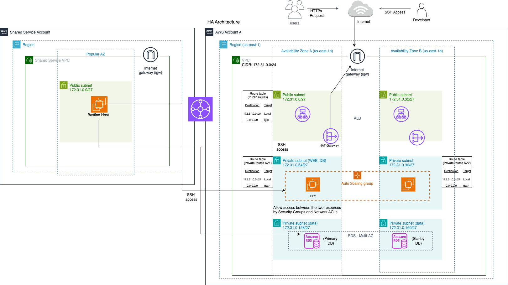

# AWS High availability (HA) Architecture with terraform
Build a website with a database interface in AWS. The infrastructure must have High Availability (AZ), Load Balancing, and an Active-Standby database setup. The web and database should be in Private Subnets, not directly accessible from the outside, with access enabled via a Bastion Host. You can choose the operating system and database you're comfortable with, but the database must be implemented using RDS (Oracle excluded). A simple webpage should be created to show that the architecture works as expected.

### Requirement

- Implement a website with a database interface in the AWS environment.
- Infrastructure must be configured with:
    - High Availability (AZ) as the default.
    - Load Balancing.
    - Active-Standby configuration for the database.
- Both the web and database must be placed in Private Subnets and should not be directly accessible from the outside.
- Access to the web and database should be enabled through a Bastion Host.
- You can choose an operating system and database that you are most comfortable with, but:
    - The database must be implemented using RDS (excluding Oracle).
- Create a simple sample webpage to demonstrate that the architecture works as expected.
- CIDR: 172.31.0.0/24

- If you don't have a sample app (react & mysql db) - https://github.com/jinyeong-park/simple-web-app-with-db


### AWS Three Tier Architecture diagram


### AWS Architecture diagram
For demo purposes, I made it simpler.


#### Terraform Setup
```
cd terraform
terraform init
terraform validate # optional
terraform plan
terraform apply
```


##### Destroy the infrastructure
```
terraform destroy
```

##### Terraform folder structure
terraform/                  # Terraform code directory  
├── main.tf                 # Defines the main infrastructure resources (EC2, RDS, VPC, etc.)  
├── provider.tf             # AWS provider configuration (connects to AWS resources)  
├── variables.tf            # Defines input variables (e.g., instance size, region, etc.)  
└── outputs.tf              # Output values (e.g., DB URL, load balancer URL, etc.)


###### More Optimized Terraform Folder Structure
```plaintext
terraform/                             # Terraform code for provisioning AWS resources
    ├── modules/                       # Reusable Terraform modules
    │   ├── vpc/                       # VPC and subnet configuration
    │   │   ├── main.tf                # VPC, subnets, route tables
    │   │   └── variables.tf           # VPC variables
    │   ├── ec2/                       # EC2 instance module (Bastion Host)
    │   │   ├── main.tf                # Bastion Host and security groups
    │   │   └── variables.tf           # EC2 variables
    │   ├── rds/                       # RDS (Active-Standby) module
    │   │   ├── main.tf                # RDS setup for Active-Standby
    │   │   └── variables.tf           # RDS variables
    │   └── alb/                       # Application Load Balancer (ALB) module
    │       ├── main.tf                # ALB setup (load balancing)
    │       └── variables.tf           # ALB variables
    ├── main.tf                        # Main entry point, tying everything together
    ├── provider.tf                    # AWS provider configuration
    ├── variables.tf                   # Variables (e.g., region, instance types)
    ├── outputs.tf                     # Outputs (e.g., DB endpoint, ALB URL)
    └── terraform_backend.tf           # Backend configuration (optional, for remote state management)
```

#### Useful Resources for Terraform
- [Terraform doc for AWS - Prerequisites](https://developer.hashicorp.com/terraform/tutorials/aws-get-started/aws-build)
- [Terraform registry AWS](https://registry.terraform.io/providers/hashicorp/aws/latest)
- [Terraform syntax](https://developer.hashicorp.com/terraform/language)


#### User data example 1 when creating an EC2 instance - public
```
User-data (public EC2)
#!/bin/bash
# Update and install dependencies
yum update -y
yum install -y httpd

# Start the Apache service
systemctl start httpd

# Enable Apache to start on boot
systemctl enable httpd

# Create a simple HTML page displaying the private IP
echo "<h1>This message is from: $(hostname -i)</h1>" > /var/www/html/index.html
```


#### user data example2 (EC2) - private (react & rds)
```
#!/bin/bash
# Update and install dependencies
yum update -y
yum install -y git nginx gcc-c++ make python3 mysql

# Install Node.js (latest version from NodeSource)
curl -sL https://rpm.nodesource.com/setup_18.x | bash -
yum install -y nodejs

# Clone the GitHub repository containing the frontend and backend
cd /home/ec2-user
git clone https://github.com/jinyeong-park/simple-web-app-with-db.git
cd simple-web-app-with-db

# Install dependencies for the backend (Node.js)
cd backend
npm install

# Set up environment variables for the backend (replace with your RDS credentials)
export DB_HOST=todolist.cjs48um081zi.us-east-1.rds.amazonaws.com
export DB_USER=admin
export DB_PASS=newpassword123
export DB_NAME=todolist
export DB_PORT=3306

# Start the backend server on port 8081 (assuming it's an Express app or similar)
nohup node server.js &

# Set up the React app (frontend)
cd ../frontend

# Install npm dependencies for React app
npm install

# Build the React app
npm run build

# Move the build folder to Nginx default folder
cp -r build/* /usr/share/nginx/html/

# Configure Nginx to serve the React app
cat <<EOF > /etc/nginx/nginx.conf
server {
    listen       80;
    server_name  localhost;

    location / {
        root   /usr/share/nginx/html;
        index  index.html index.htm;
    }

    error_page   500 502 503 504  /50x.html;
    location = /50x.html {
        root   /usr/share/nginx/html;
    }
}
EOF

# Start Nginx and enable it on boot
systemctl start nginx
systemctl enable nginx

# Optionally, you can configure a security group to allow traffic to ports 80 (HTTP) and 443 (HTTPS)
# If required, allow connections from the private EC2 to the RDS instance.

# Restart Nginx to apply changes
systemctl restart nginx

echo "Private EC2 instance setup complete."
```
